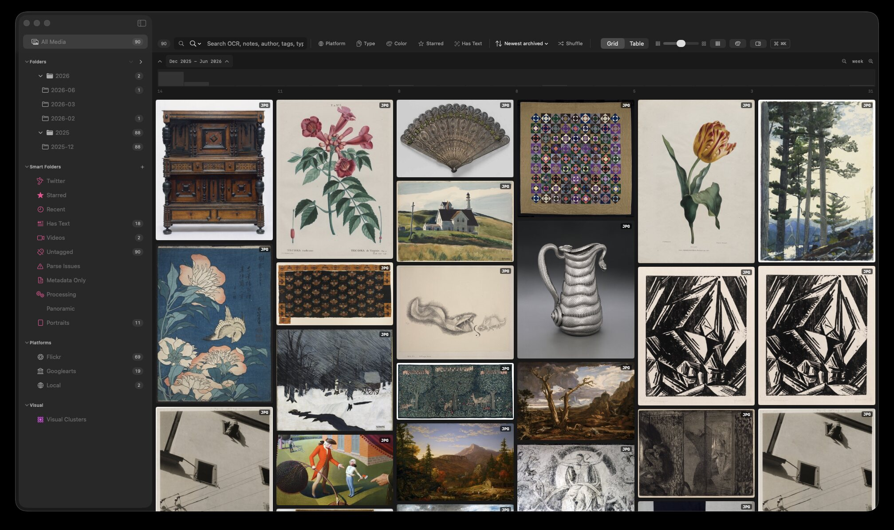

# NoDraw

NoDraw is a personal media-archive project for the Mac. Its DNA is half
Obsidian vault, where ordinary media files keep Markdown sidecars with their
source and notes, and half the kind of heavy visual reference browser made for
staring at ten thousand images.

I built it partly to play with what Apple ships natively on the Mac: SwiftUI,
AppKit, Vision OCR, media frameworks, and the strange edges where they meet.

## Download

Download the latest macOS build from
[GitHub Releases](https://github.com/mduncs/nodraw-app/releases/latest).

The showcase build requires macOS 14 or newer. It uses an isolated bundle ID,
app-data directory, and archive directory, so it can live beside my private
development build without touching its data or local services.

The release does not include the sample media pictured above.

## What it does

- browses images and video as a masonry grid, table, timeline, or focus view
- keeps source, notes, and metadata in Markdown sidecars beside ordinary files
- searches OCR, metadata, filenames, notes, and tags
- extracts local thumbnails, colors, and media metadata

This repository currently distributes the showcase build and release notes.
Source publication is a separate decision.
