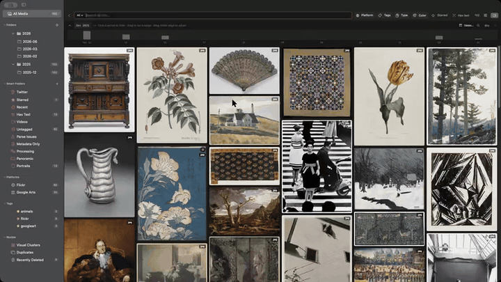
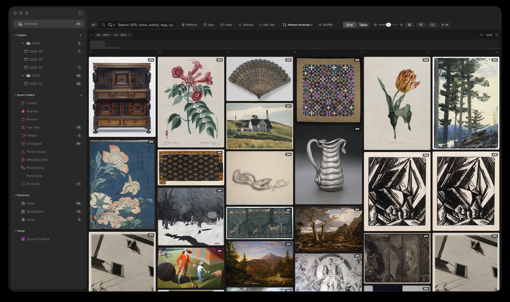

<p align="center">
  
</p>

# NoDraw

## Hello, human

---

I wanted a better media downloading tool, and that begat a need for an organizer. I didn't like the free or paid versions, so I made my own. This is the worst software I ever made, it was the first - maybe some of it will be useful to you? Have at it
### Why this is public

NoDraw is personal software. I built it with AI coding agents for my own use: to keep a large archive of images and video saved from the web browsable, searchable and tagged on my Mac. I'm publishing it because there's no reason not to.

Consider it a courtesy. If you, or an agent working for you, are building something similar, there may be something useful here. It isn't supported, and I won't be testing it on other setups or promising fixes. The tokens have been spent; this is me giving some back.

<p align="center">
  
</p>

## What it is

NoDraw is a native macOS app for a folder of media files that each carry a Markdown sidecar: source URL, author, dates, tags and notes in YAML frontmatter, readable in any text editor or Obsidian vault. The app indexes that folder into SQLite, analyses every file on the Mac, and presents it as a dense visual reference library. A browser extension and a small local server capture posts from the web into the same folder.



## Install

Download `NoDraw-1.1-macOS.zip` from [Releases](https://github.com/mduncs/nodraw-app/releases/latest), unzip it and move NoDraw to Applications.

The build is unsigned: it's ad-hoc signed and not notarized by Apple, so macOS blocks it the first time. Open it once, then go to System Settings → Privacy & Security and click **Open Anyway**. Or build it from source (below), or have your agent do it.

The zip holds the app only. The sample media pictured above is not included; `Resources/DemoArchive/` in this repository holds a small synthetic library to point the app at. Web capture needs the server and extension from source (see Build and run).

## Features

**Browsing.** A column masonry grid with adjustable density, an optional layout that groups similar aspect ratios, a date-range timeline strip, and shuffle. A focus view opens one item with a multi-file carousel, video playback with trim, an inspector, and the page screenshot captured alongside the post.

**Finding things.** Full-text search covers OCR text, notes, authors, tags, filenames, source URLs and community names (subreddit, channel, board). An Image Match scope finds pictures from a text description using locally computed image embeddings. Filters cover platform, tags, media type, starred, "has text", and colour, by twelve colour groups or an exact RGB value. Smart folders save rule sets. The Related tab in the focus view lists items by the same author, in the same folder, and with shared tags.

**Organizing.** Hierarchical, coloured tags with rules that tag new items automatically from their source fields. Stars, notes, and a tagging queue that walks through untagged items. Tags, notes, stars and deletions are written back to the sidecar files, so the folder stays the source of truth.

**Looking closely.** Vision OCR with an on-image text overlay. Local speech transcription for audio and video. A layered image editor with shapes, arrows, text, highlighter, subject and person selection, background removal, crop and basic adjustments, plus export with IPTC/EXIF metadata embedded.

**Capturing.** Chrome and Firefox builds of one extension save posts from X, Bluesky, Reddit and YouTube, plus gallery and museum sites such as Flickr, DeviantArt, ArtStation and Wikimedia Commons. Modifier keys choose full capture, media only, or screenshot plus metadata, and a small form adds tags and a note after saving. The extension hands work to a local FastAPI server that downloads with yt-dlp, gallery-dl or dezoomify-rs and writes the files and sidecar into the archive.

**Housekeeping.** Duplicate review using exact hashes and perceptual look-alikes, visual clusters, Recently Deleted, folder watching so new files appear on their own, and drag-and-drop import that skips files already in the library.

### What a short film can't show

- It is keyboard-first: vim-style grid movement, Space to preview, S to star, T to tag, O to open the source, ⌘K command palette, and ⌘/ for the full shortcut reference. Mouse buttons 4 and 5 go back and reopen the last item, and middle-click autoscrolls.
- Holding ⌥ (configurable) opens a sunburst, radial or grid tag selector, and the tagging queue maps tags to the 1–0 and q–p keys.
- The search box takes tokens such as `author:`, `tag:none`, `-tag:`, `platform:`, `ext:`, `ratio:` and `recent:`.
- Media without a sidecar gets one generated, so a plain folder of files also works.

## Requirements

- macOS 14 (Sonoma) or newer, on a Mac with Apple silicon. The release is arm64 only, and the source does not currently compile for Intel Macs.
- Xcode 16 or newer to build (FluidAudio needs Swift 6 tools; the package manifest is 5.9).
- For capture: Python 3 for the server, Node.js to build the extension, Chrome 120+ or Firefox 140+.

## Build and run

```sh
swift build -c release --product NoDraw
swift test

./scripts/build-release.sh        # dist/NoDraw.app and a zip; ad-hoc signed unless CODESIGN_IDENTITY is set

npm ci --prefix extension
./scripts/build-extensions.sh     # Firefox XPI and Chrome zip/unpacked builds
npm test --prefix extension
```

The three shared Swift packages in `Vendor/` (subject isolation, the photo analysis pipeline, and the table view) are copied in so a clean clone builds on its own. On first launch the app asks for an archive folder; the default is `~/MediaArchive`. The download server is off until enabled under Settings → Downloads. A debug build (`swift build`) runs it from `server/`, using `server/venv/bin/python3` when that venv exists. A release build looks for a packaged binary instead: `python server/build.py` writes `server/dist/media-archiver`, which goes in `~/Library/Application Support/NoDraw/download-server/`.

## How it works

The archive is the record: `YYYY-MM/<stem>.<ext>`, `<stem>.md`, and an optional `<stem>.context.png` screenshot. The app scans and watches the folder with FSEvents, parses sidecars, and stores the index in SQLite through GRDB. Background jobs generate thumbnails, extract colours, run Vision OCR, transcribe audio with FluidAudio, and compute image embeddings and attributes through the vendored PhotoPipeline package, which loads private Apple frameworks with `dlopen`. That is why the app is not sandboxed and is not on the App Store. User edits flow back to the sidecars through a write-back queue.

## Data and privacy

- App data lives in `~/Library/Application Support/NoDraw/` (database, thumbnails, helper tools), logs in `~/Library/Logs/NoDraw/`. Crash reports are local files and are not uploaded.
- Analysis runs on the Mac. There is no telemetry and no update check.
- Network use: the transcription model download on first use, ffmpeg and dezoomify-rs from GitHub releases when you choose Install Missing, and whatever the download tools fetch for a capture.
- The server listens on loopback only (port 8847 when the app runs it as a LaunchAgent) and accepts writes only from an extension origin. The extension asks for broad host access so it can capture from any site.

## Limitations and known issues

- Sidecars with an empty `source:` field are skipped by the folder scan and watcher. The failure is recorded in the database but not shown anywhere. Drag-and-drop import accepts them.
- The hold-to-tag selector checks the live modifier state, so scripted or synthetic key events don't open it. The T popover works for scripting.
- The "Similar" group in Related is always empty, and speech transcripts are not part of library search.
- Install Missing also tries to download the packaged server from a private repository, which fails for anyone else. Use a debug build or `server/build.py` as above.
- Video trim works on MP4, MOV and M4V only. Shortcuts can't be remapped.
- Table, boards and canvas views exist in code but are switched off.
- The app uses the bundle ID `com.nodraw.app` and the default folders above. The July 2026 1.0 showcase build used a separate bundle ID, so the two keep separate settings.

## License

MIT. See `LICENSE`.

## Keywords

macOS, SwiftUI, AppKit, Swift, media archive, digital asset management, image library, reference image browser, masonry grid, Markdown sidecar, YAML frontmatter, Obsidian vault, SQLite, GRDB, Vision OCR, speech transcription, FluidAudio, Parakeet, CLIP image search, perceptual hash duplicates, subject lift, image annotation, browser extension, Chrome extension, Firefox extension, FastAPI, yt-dlp, gallery-dl, social media archiver, local-first
